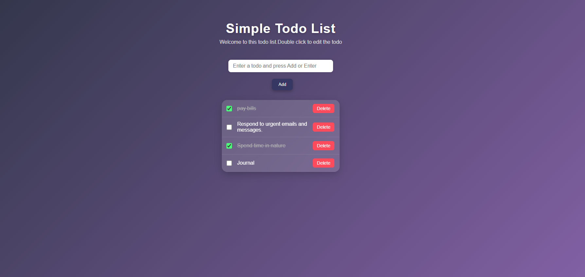

# 📝 To-Do List 

A simple and responsive **To-Do List ** built using **HTML**, **CSS**, and **JavaScript**.  
This app helps users add, delete, and manage daily tasks easily in a clean and minimal UI.

---

## 🚀 Live Demo
🔗 [View Live Site](https://github.com/Yamuna2404/todo-list-js)

---

## ✨ Features
- ➕ Add new tasks  
- ✅ Mark tasks as completed  
- ❌ Delete tasks  
- 💾 Local Storage support (saves tasks even after reloading)  
- 📱 Responsive design for mobile and desktop  

---

## 🧰 Technologies Used
- **HTML5**
- **CSS3**
- **JavaScript (Vanilla JS)**

---

## 📸 Preview


---

## 💡 How to Use
1. Clone the repository  
   ```bash
   git clone https://github.com/Yamuna2404/todo-list-js

## 📧 Author & Contact

**Yamuna Garasiya**  
- 📧 Email: [garasiyaemma2401@gmail.com](mailto:garasiyaemma2401@gmail.com)  
- 🔗 LinkedIn: [linkedin.com/in/your-linkedin](#)  
- 🐙 GitHub: [github.com/Yamuna2404](https://github.com/Yamuna2404)
